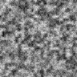
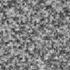

# ЛР №1-1. Подготовка рабочей среды и паспорт воспроизводимого AI-эксперимента

**Вариант 7** — бумажная текстура (подложка макета).  
Изменяемый фактор: размер изображения ×1,5 — `96×96 → 144×144`.

| | |
| --- | --- |
| Генератор | `lab01_generator.py` v1.0, только стандартная библиотека Python |
| Базовые параметры | seed `101`, n `5`, cell `4`, octaves `3`, persistence `0.6`, quantize `8`, smooth interpolation |
| Критерий | `|Δ| > 2·s_base` |
| Среда сохранённого прогона | CPython 3.12.0, Windows 11, AMD64, zlib 1.2.13 |
| Результат | протокол воспроизводимости выполнен; существенного изменения четырёх метрик не обнаружено |

## Гипотеза

Увеличение размера изображения при неизменных остальных параметрах не должно приводить к существенному изменению средней яркости, контраста, граничной энергии и энтропии относительно межseedового разброса.

Для прикладной оценки бумажной подложки заранее принят порог контраста `0.15`.

## Результат

| Метрика | База | Фактор | Δ | `|Δ|/s` | Существенно |
| --- | ---: | ---: | ---: | ---: | :---: |
| Средняя яркость | 0.5037 | 0.5012 | −0.0024 | 0.31 | нет |
| Контраст | 0.1394 | 0.1390 | −0.0004 | 0.20 | нет |
| Граничная энергия | 0.0835 | 0.0836 | +0.00005 | 0.06 | нет |
| Энтропия | 7.1741 | 7.1807 | +0.0065 | 0.32 | нет |

При `n=5` ни одна метрика не превысила заданный порог. Гипотеза не опровергнута. Значение контраста осталось ниже практического порога 0.15 как в базовой, так и в факторной серии.

### Пара изображений seed 101

| База 96×96 | Фактор 144×144 |
| --- | --- |
|  |  |

## Как повторить

Создать и активировать виртуальное окружение:

```powershell
py -3.12 -m venv .venv
.\.venv\Scripts\Activate.ps1
```

Сторонние пакеты не требуются. Запуск варианта:

```powershell
python src\lab01_experiment.py --variant 7 --out artifacts\v07
```

## Что где лежит

| Путь | Содержимое |
| --- | --- |
| [src/](src) | учебный генератор и скрипт эксперимента |
| [configs/variant_07.json](configs/variant_07.json) | вариант, гипотеза, параметры и заранее выбранные критерии |
| [artifacts/v07/](artifacts/v07) | паспорт, результаты и изображения эксперимента |
| [requirements.txt](requirements.txt) | список сторонних зависимостей; пустой, так как используется стандартная библиотека |
| [reports/environment.txt](reports/environment.txt) | зафиксированная среда |
| [reports/journal.md](reports/journal.md) | журнал гипотезы, команд и наблюдений |
| [reports/error_demo.md](reports/error_demo.md) | демонстрация невоспроизводимости без seed и исправление |

Виртуальное окружение `.venv` и преподавательские демонстрационные материалы в репозиторий не включаются.
