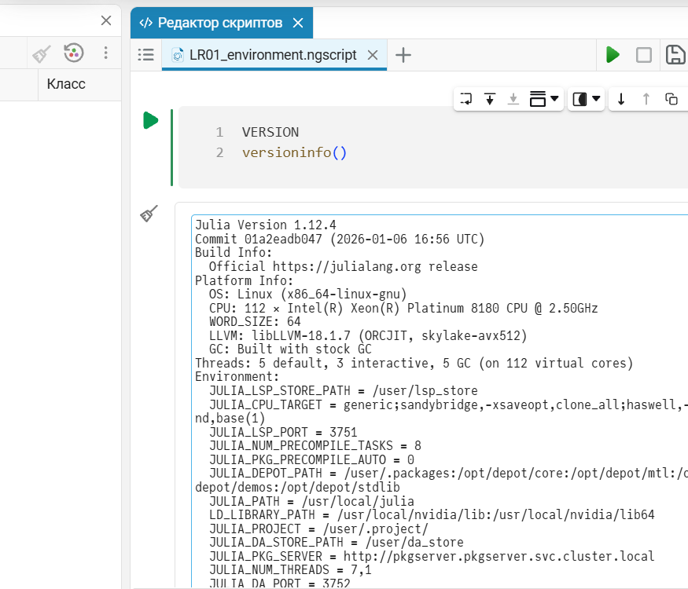
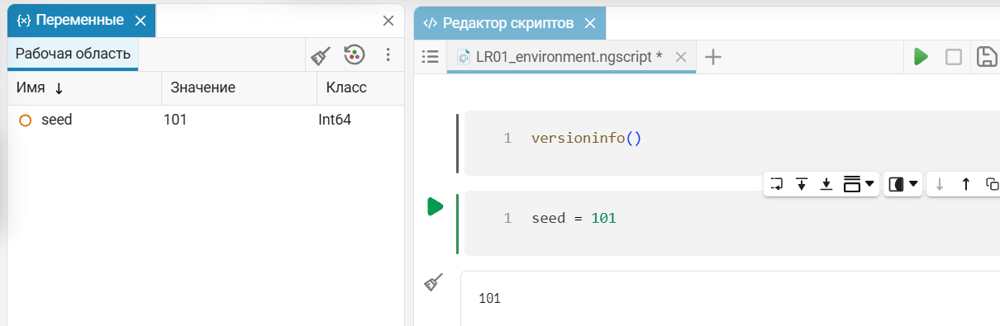
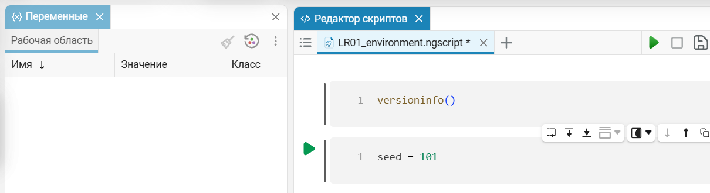
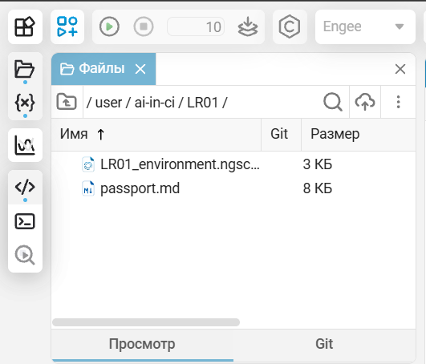

# Лабораторная работа №1

## Подготовка рабочей среды и паспорт воспроизводимого AI-эксперимента

**Вариант:** 7  
**Контекст:** бумажная текстура (подложка макета)  
**Исследуемый фактор:** увеличение размера изображения в 1,5 раза (`96×96 → 144×144`)

---

## 1. Цель работы

Цель работы — освоить подготовку воспроизводимой рабочей среды, научиться фиксировать условия AI-эксперимента в паспорте и проверять воспроизводимость результата с помощью измерений.

В рамках индивидуального варианта необходимо исследовать бумажную текстуру, используемую как подложка макета под мелкий текст, и определить, приводит ли увеличение размера изображения с `96×96` до `144×144` пикселей к заметному изменению статистических характеристик изображения.

---

## 2. Постановка задачи и гипотеза

Бумажная текстура используется как фоновая подложка под мелкий текст, поэтому для неё важны низкая визуальная заметность и отсутствие выраженных крупных пятен.

Исследуемым фактором является размер изображения. В базовой серии размер составлял `96×96`, а в факторной серии был увеличен в 1,5 раза — до `144×144`. Остальные параметры генератора сохранялись неизменными.

До запуска эксперимента была сформулирована следующая гипотеза:

> Увеличение размера изображения с `96×96` до `144×144` при неизменных остальных параметрах не приведёт к существенному изменению средней яркости, контраста, граничной энергии и энтропии относительно межseedового разброса.

До просмотра результатов также были зафиксированы два критерия:

- учебный критерий существенности: `|Δ| > 2·s_base`;
- практический порог контраста для малозаметной подложки: `0.15`.

Если отношение абсолютной разности средних к выборочному стандартному отклонению базовой серии превышает `2`, изменение считается существенным в рамках данной лабораторной работы.

Этот критерий является учебным и не заменяет полноценную статистическую проверку гипотез.

---

## 3. Данные и используемый генератор

Внешние наборы данных в работе не использовались. Все изображения являются синтетическими и создаются учебным процедурным генератором:

`lab01_generator.py`, версия `1.0`.

Для выполнения работы использовалась только стандартная библиотека Python. Сторонние пакеты не требуются.

Случайность генерации определяется параметром `seed`. При одинаковых параметрах генератора и одинаковом `seed` должен формироваться одинаковый массив пикселей. Если `seed` не зафиксирован, результат запуска не является воспроизводимым.

Для анализа изображений использовались четыре метрики:

- `mean` — средняя яркость изображения;
- `contrast` — стандартное отклонение яркости, характеризующее контраст;
- `edge` — характеристика перепадов яркости между соседними пикселями;
- `entropy` — энтропия распределения яркости.

---

## 4. Рабочая среда

### 4.1. Локальная среда

Для выполнения основной части лабораторной была подготовлена изолированная среда Python `.venv`.

Фактически использованная среда:

| Параметр | Значение |
| --- | --- |
| Python | `3.12.0` |
| Реализация | `CPython` |
| ОС | `Windows 11` |
| Архитектура | `AMD64` |
| zlib | `1.2.13` |
| Версия генератора | `1.0` |
| Сторонние пакеты | не используются |

Виртуальная среда `.venv` не включается в репозиторий и при необходимости может быть создана повторно.

SHA-256 использованных скриптов:

- `lab01_generator.py`: `8f07d340a5a765a8e44f1fec407489cf00114ba54216aa7539c4e7116680e152`;
- `lab01_experiment.py`: `69257206dab50ef35de448b45764daad0d4f60dbc98febd8953c6faee28e06b5`.

### 4.2. Среда Engee

Часть Б работы была выполнена `26.09.2026` примерно в `00:50` по местному времени.

Зафиксированы следующие параметры:

| Параметр | Значение |
| --- | --- |
| Engee | `26.9.2-H1` |
| Версия личного кабинета | `v26.9.1.1` |
| Julia | `1.12.4` |
| ОС вычислительной среды | `Linux (x86_64-linux-gnu)` |
| CPU | `112 × Intel(R) Xeon(R) Platinum 8180 CPU @ 2.50GHz` |

В Engee были созданы:

- `/user/ai-in-ci/`;
- `/user/ai-in-ci/LR01/`;
- `/user/ai-in-ci/LR01/LR01_environment.ngscript`.

В каталог лабораторной также был загружен паспорт эксперимента:

`/user/ai-in-ci/LR01/passport.md`.

Полный сохранённый вывод среды находится в файле [engee_environment.txt](engee_environment.txt).

---

## 5. Параметры эксперимента

Параметры базовой и факторной серий представлены в таблице.

| Параметр | Базовая серия | Факторная серия |
| --- | ---: | ---: |
| Размер изображения | `96×96` | `144×144` |
| `cell` | `4` | `4` |
| `octaves` | `3` | `3` |
| `persistence` | `0.6` | `0.6` |
| `quantize` | `8` | `8` |
| `interp` | `smooth` | `smooth` |
| Базовый seed | `101` | `101` |
| Число seed | `5` | `5` |

Для оценки межseedового разброса использовалась серия:

`101, 102, 103, 104, 105`.

При изменении размера изображения меняется размер случайной решётки, используемой генератором. Поэтому факторное изображение размером `144×144` нельзя рассматривать как простое увеличение изображения `96×96`.

В данной работе сравнивались не соответствующие пиксели двух изображений, а статистические характеристики серий генераций.

---

## 6. Ход выполнения работы

Сначала была подготовлена изолированная среда Python и зафиксированы её параметры.

До запуска основного эксперимента в журнал были записаны гипотеза, критерий существенности и практический порог контраста.

Затем была проверена типовая ошибка воспроизводимости. Генератор дважды запускался без указания `--seed`. В этом случае использовались различные значения seed, полученные из системного времени, поэтому результаты и SHA-256 массивов пикселей различались.

После этого два запуска были выполнены с явно заданным `--seed 101`. Полученные SHA-256 массивов пикселей совпали.

Основной эксперимент варианта 7 выполнялся командой:

```powershell
python src\lab01_experiment.py --variant 7 --out artifacts\v07
```

В рамках основного эксперимента были:

1. проверены четыре запуска протокола воспроизводимости;
2. рассчитан межseedовый разброс для серии из пяти seed;
3. сформирована факторная серия с увеличенным размером изображения;
4. рассчитаны четыре статистические метрики;
5. изменение каждой метрики сопоставлено с заранее установленным критерием;
6. результаты сопоставлены с исходной гипотезой;
7. сформирован и дополнен паспорт эксперимента;
8. выполнена часть Б в среде Engee.

---

## 7. Проверка воспроизводимости

Для проверки воспроизводимости были выполнены четыре запуска с последовательностью seed:

`101, 101, 1101, 101`.

Результаты:

| Запуск | seed | SHA-256 массива пикселей, первые 16 символов |
| ---: | ---: | --- |
| 1 | `101` | `c05137283673ac4e` |
| 2 | `101` | `c05137283673ac4e` |
| 3 | `1101` | `5db76f00da9a3ddc` |
| 4 | `101` | `c05137283673ac4e` |

Проверки равенства дали следующий результат:

```text
EQ_1_2 = true
EQ_1_4 = true
EQ_1_3 = false
EQ_2_4 = true
```

Первый, второй и четвёртый запуски имели одинаковый `seed = 101` и дали одинаковые массивы пикселей.

Третий запуск выполнялся с другим `seed = 1101`, поэтому его массив пикселей отличается.

Таким образом, выполненный протокол подтверждает воспроизводимость генератора при фиксированных параметрах и фиксированном seed.

### Типовая ошибка: seed не задан

При двух отдельных запусках генератора без параметра `--seed` были получены:

| Запуск | seed | SHA-256 массива пикселей |
| ---: | ---: | --- |
| 1 | `18649652` | `6a6289586e9466726cff5b49bb1a8c45386ea7c3c62f59017b3b02c156e74f0a` |
| 2 | `1396468852` | `c366c933daa70824e593939edeb302372c172d2ac3585077ae857a492f354f16` |

После фиксации `--seed 101` два запуска дали одинаковый SHA-256:

`93fae5913d79728429ddcdf533063672739fd51e5afa6a7ac243e3e6a80d290b`.

Следовательно, причиной невоспроизводимости в первом случае являлось отсутствие зафиксированного seed.

---

## 8. Влияние размера изображения на метрики

Для базовой и факторной серий были рассчитаны средние значения метрик и выборочное стандартное отклонение базовой серии.

Результаты представлены в таблице.

| Метрика | Среднее (база) | s (база) | Среднее (фактор) | Δ | Отношение Δ к s | Вывод по критерию |
| --- | ---: | ---: | ---: | ---: | ---: | --- |
| mean | 0.5037 | 0.0078 | 0.5012 | -0.0024 | 0.31 | не обнаружено при n=5 |
| contrast | 0.1394 | 0.0022 | 0.1390 | -0.0004 | 0.20 | не обнаружено при n=5 |
| edge | 0.0835 | 0.0008 | 0.0836 | +0.00005 | 0.06 | не обнаружено при n=5 |
| entropy | 7.1741 | 0.0206 | 7.1807 | +0.0065 | 0.32 | не обнаружено при n=5 |

Для признания эффекта существенным требовалось выполнение условия:

`|Δ| > 2·s_base`.

Ни для одной из четырёх метрик это условие не выполнилось.

Наибольшее отношение изменения к межseedовому разбросу наблюдалось для энтропии и составило приблизительно `0.32`, что значительно ниже порога `2`.

Таким образом, при `n = 5` существенного изменения средней яркости, контраста, граничной энергии и энтропии при увеличении размера изображения с `96×96` до `144×144` не обнаружено.

Полученный результат не доказывает полного отсутствия влияния размера, а означает только то, что в условиях данного эксперимента эффект не превысил выбранный критерий относительно наблюдавшегося межseedового разброса.

---

## 9. Практическая оценка бумажной подложки

Для бумажной текстуры важна низкая заметность подложки под мелким текстом.

До запуска эксперимента был выбран практический порог контраста:

`0.15`.

Получены следующие средние значения контраста:

- базовая серия: `0.1394`;
- факторная серия: `0.1390`.

Оба значения находятся ниже заранее установленного порога `0.15`.

Следовательно, по выбранному показателю контраста увеличение размера изображения не привело к превышению рабочего порога малозаметности подложки.

При этом данный эксперимент не является непосредственной проверкой читаемости текста. Пользовательское исследование или измерение читаемости мелкого текста не проводилось, поэтому вывод относится только к выбранной числовой характеристике контраста.

---

## 10. Иллюстрации результата

Для визуальной иллюстрации ниже приведены изображения с одинаковым `seed = 101`.

| База `96×96` | Фактор `144×144` |
| --- | --- |
|  |  |

Изображения приведены только для визуального представления результата.

Из-за изменения размера случайной решётки это не одно и то же изображение до и после масштабирования. Основной вывод эксперимента получен на основе статистик серии seed, а не попиксельного сравнения данной пары.

---

## 11. Работа в Engee

В среде Engee был создан и сохранён скрипт `LR01_environment.ngscript`.

В одной ячейке были выполнены:

```julia
VERSION
versioninfo()
```

По выводу среды была зафиксирована версия Julia `1.12.4` и параметры вычислительной системы.

Для проверки состояния рабочей области выполнена команда:

```julia
seed = 101
```

После её выполнения в рабочей области появилась переменная `seed` со значением `101` и классом `Int64`.

После действия «Очистить все переменные» рабочая область стала пустой.

После выполнения «Перезапуск ядра» рабочая область также осталась пустой.

Это показывает, что состояние интерактивной рабочей области зависит от уже выполненных команд. Для воспроизводимости необходимо фиксировать порядок выполнения действий и не полагаться на состояние, оставшееся от предыдущей сессии.

### Подтверждающие материалы

**Информация о среде Engee и выполнение `VERSION` / `versioninfo()`:**



**Переменная `seed = 101` в рабочей области:**



**Рабочая область после очистки переменных:**



**Загруженный в каталог лабораторной паспорт эксперимента:**



Паспорт `passport.md` был загружен в каталог:

`/user/ai-in-ci/LR01/`.

---

## 12. Ошибки, риски и ограничения

В ходе работы была рассмотрена типовая ошибка воспроизводимости — запуск генератора без фиксированного seed. В этом случае одинаковая команда приводит к различным результатам. Ошибка устраняется явным заданием и сохранением seed.

Для варианта 7 существует дополнительный риск неправильной интерпретации фактора. При изменении размера изображения меняется используемая генератором случайная решётка. Поэтому факторное изображение нельзя считать просто увеличенной копией базового и нельзя делать вывод на основе непосредственного сравнения соответствующих пикселей.

Основные ограничения проведённого эксперимента:

- использована небольшая серия `n = 5`;
- исследован только один тип текстуры;
- изменялся только один фактор;
- критерий `|Δ| > 2·s_base` является учебным и не представляет собой полноценный статистический тест;
- четыре метрики описывают статистические свойства яркости, но не дают полной оценки визуального или эстетического качества изображения;
- фактическая читаемость мелкого текста непосредственно не измерялась;
- отсутствие обнаруженного эффекта не означает доказанного отсутствия эффекта при других условиях или большем объёме выборки.

---

## 13. Вывод

В ходе лабораторной работы была подготовлена и зафиксирована воспроизводимая рабочая среда, определены параметры генератора и сформирован паспорт эксперимента.

Проверка воспроизводимости показала ожидаемый результат: запуски с одинаковым `seed = 101` и одинаковыми параметрами дали одинаковые массивы пикселей, а запуск с другим `seed = 1101` дал другой результат. Протокол воспроизводимости составил `true, true, false, true`.

Также была продемонстрирована типовая ошибка запуска без фиксированного seed. При отсутствии `--seed` два запуска дали различные значения seed и различные SHA-256. После фиксации `seed = 101` результаты совпали.

Для варианта 7 было исследовано влияние увеличения размера бумажной текстуры с `96×96` до `144×144` пикселей. При `n = 5` существенного изменения средней яркости, контраста, граничной энергии и энтропии по заранее установленному критерию не обнаружено. Исходная гипотеза не опровергнута.

Средний контраст составил `0.1394` для базовой серии и `0.1390` для факторной. Оба значения находятся ниже заранее выбранного практического порога `0.15`, поэтому по данному критерию увеличение размера не привело к превышению порога малозаметности бумажной подложки.

Полученные выводы относятся только к условиям проведённого эксперимента и не доказывают полного отсутствия влияния размера при других параметрах, большем числе запусков или других способах оценки изображения.

---

## 14. Артефакты работы

| Артефакт | Назначение |
| --- | --- |
| [passport.md](../artifacts/v07/passport.md) | человекочитаемый паспорт эксперимента |
| [passport.json](../artifacts/v07/passport.json) | машинно-читаемый паспорт |
| [results.json](../artifacts/v07/results.json) | фактические результаты основного эксперимента |
| [journal.md](journal.md) | журнал выполнения работы |
| [environment.txt](environment.txt) | параметры локальной среды |
| [engee_environment.txt](engee_environment.txt) | полный сохранённый вывод среды Engee |
| [error_demo.md](error_demo.md) | демонстрация ошибки воспроизводимости без seed |
| [screenshots/](screenshots/) | подтверждающие изображения части Б |