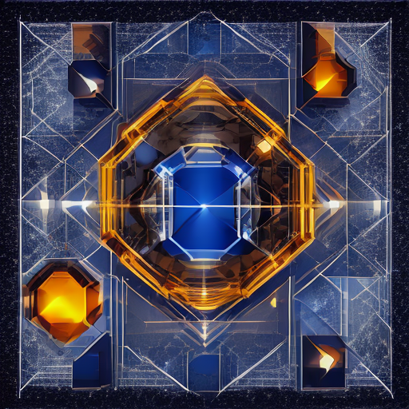

# ЛР №1. Запуск открытой модели text-to-image

**Вариант 6** — постер для медиалаборатории.  
Изменяемый фактор: иерархия объектов в prompt.

| | |
| --- | --- |
| Модель | `stabilityai/sd-turbo`, ревизия `b261bac6fd2cf515557d5d0707481eafa0485ec2` |
| Параметры | seed `20260917`, steps `1`, guidance `0.0`, 512 × 512 |
| Среда сохранённого прогона | AMD Ryzen 5 5500U, CPU, `float32`, Windows 11 |
| Результат | два запуска, SHA-256 совпали побитово |

## Результат



Главный объект визуально доминирует над второстепенными элементами, что соответствует критерию варианта.

## Как повторить

Создать и активировать виртуальное окружение:

```powershell
py -3.12 -m venv .venv
.\.venv\Scripts\Activate.ps1
```

Установить PyTorch для CPU:

```powershell
python -m pip install torch==2.7.1 torchvision==0.22.1 --index-url https://download.pytorch.org/whl/cpu
```

Установить остальные зависимости:

```powershell
python -m pip install "diffusers==0.40.0" "transformers==5.17.0" "accelerate==1.15.0" "safetensors==0.8.0" "Pillow>=11,<13"
```

Задать каталог кэша Hugging Face и запустить:

```powershell
$env:HF_HOME = "$PWD\cache\huggingface"
python src/run_reproducibility.py
```

Первый запуск скачивает веса модели и поэтому занимает больше времени.

## Что где лежит

| Путь | Содержимое |
| --- | --- |
| [src/](src) | основной скрипт и копия с намеренной CUDA-ошибкой |
| [artifacts/](artifacts) | `run_001`, `run_002`: `result.png` + `manifest.json` |
| [reports/](reports) | окружение, журналы запусков, сравнение SHA-256 и лог ошибки |
| [configs/](configs) | `run_config.json` — параметры эксперимента |

Кэш весов и виртуальное окружение в репозиторий не включаются.