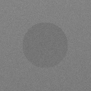
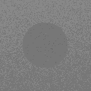
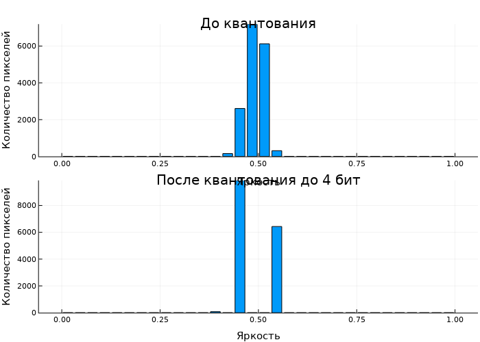

# Лабораторная работа №3

## Подготовка изображений и визуализация в Engee

**Вариант:** 7  
**Сцена:** низкий контраст  
**Воздействие:** квантование яркости до 4 бит  
**Студент:** _Провков Иван Александрович_  
**Группа:** _Т26ИИКТ-МИК11_

---

## 1. Цель работы

Цель работы — подготовить синтетическое изображение к обработке в Engee, исследовать влияние квантования яркости до 4 бит и оценить изменение данных по гистограмме, PSNR, средней яркости, контрасту и энтропии.

## 2. Постановка задачи, гипотеза и критерии

По варианту 7 исследуется синтетическая низкоконтрастная сцена. Воздействие — квантование яркости до 4 бит, то есть до 16 уровней.

Гипотеза и практический допуск были зафиксированы до применения воздействия варианта и до просмотра итоговых результатов `variant_summary(7)`:

> При квантовании низкоконтрастной сцены до 4 бит средняя яркость изменится слабо, наиболее заметное изменение ожидается в распределении яркости и энтропии. Контраст также может измениться.

Практический допуск: относительное изменение метрики более 5 % или средний PSNR ниже 30 dB считается практически существенным.

Статистический критерий из методички:

`|Δ| > 2·s`,

где `s` — выборочное стандартное отклонение метрики в базовой серии seed `101:105`.

## 3. Данные и ограничения

В работе использована синтетическая сцена, созданная преподавательской функцией `make_scene`. Внешние изображения и персональные данные не использовались.

Параметры сцены:

| Параметр | Значение |
| --- | ---: |
| Размер | `128×128` |
| `lo` | `0.40` |
| `hi` | `0.60` |
| `noise` | `0.02` |
| `checker` | `0` |
| Основной seed | `101` |
| Серия seed | `101, 102, 103, 104, 105` |
| Интервалы гистограммы | `32` |

Эксперимент описывает одну синтетическую сцену и серию из пяти seed. PSNR оценивает численное отличие, но не воспринимаемое качество. Практический порог 5 % является учебным и условным.

## 4. Рабочая среда

| Параметр | Значение |
| --- | --- |
| Engee | `26.9.2-H4` |
| Julia | `1.12.4` |
| Учебная библиотека | `lab03_lib.jl`, 5027 байт |
| Semantic version библиотеки | не указана в предоставленном файле |
| SHA-256 библиотеки | `cd1622643e7cfe7cc01bb7d8067e4802a76f6a76e9a6833ba4c09c84bb9fa62a` |

Версии Engee и Julia подтверждены stdout экспортированного notebook. Отдельный номер версии учебной библиотеки `lab03_lib.jl` в предоставленном файле не указан. Для идентификации используемой копии фактически вычислены её размер и SHA-256.

В текущем запуске зафиксированы Engee `26.9.2-H4` и Julia `1.12.4`. Тип исходного изображения подтверждён фактически как `RGB{Float64}`; яркость обрабатывается как массив значений `Float64`. В работе использовались пакеты Images, Random, Statistics, SHA и Plots, однако их точные версии в экспортированном выводе текущей сессии отдельно не фиксировались. Команда `versioninfo()` в текущем экспорте ЛР03 отсутствует, поэтому ОС и CPU вычислительной среды не выдаются за повторно подтверждённые значения. Device отдельно не фиксировался.

Справочно: в ЛР01 при выполнении `versioninfo()` в Engee `26.9.2-H1` были зафиксированы Linux (`x86_64-linux-gnu`) и `112 × Intel(R) Xeon(R) Platinum 8180 CPU @ 2.50GHz`. Поскольку ЛР03 выполнялась уже в Engee `26.9.2-H4`, эти сведения рассматриваются только как данные предыдущей сессии.

## 5. Ход работы

В начале notebook подключена преподавательская библиотека:

```julia
include("/user/ai-in-ci/LR03/lab03_lib.jl")
```

Сцена создана с фиксированным seed:

```julia
scene = make_scene(
    101;
    lo=0.40,
    hi=0.60,
    noise=0.02,
    checker=0
)
println(describe_image(scene))
```

Яркость получена двумя способами, после чего рассчитана максимальная абсолютная разность:

```julia
gray_manual = luma_manual(scene)
gray_images = luma_images(scene)
maxdiff = maximum(abs.(gray_manual .- gray_images))
```

Для проверки воспроизводимости сцена с seed `101` построена дважды, а SHA-256 рассчитан по массиву яркости. Затем применён фактор `apply_factor(before, 1)`, построены гистограммы по 32 интервалам, сохранены PNG и выполнен `variant_summary(7)`.

## 6. Результаты

### 6.1. Свойства сцены

| Свойство | Значение |
| --- | --- |
| Размер | `(128, 128)` |
| Тип элемента | `RGB{Float64}` |
| Минимум | `0.3311562226432249` |
| Максимум | `0.6685814096363565` |
| Объём массива | `393216` байт |

Максимальная абсолютная разность ручного расчёта яркости и `luma_images` равна `6.019111098432006e-9`. Разность мала и соответствует сравнению с допуском, а не побитовому сравнению двух разных способов вычисления. Ненулевая разность возникает из-за различий в порядке вычислений и округлении операций с плавающей точкой `Float64` при ручной формуле и преобразовании `Gray`.

### 6.2. Воспроизводимость

Оба построения сцены с seed `101` дали SHA-256:

`855526fd63358f26e2528df368914a0afe8f5f9ba808d664c98c41c6c5c64295`.

Результат сравнения: `true`. Воспроизводимость массива яркости при одинаковом seed подтверждена.

### 6.3. Изображения и гистограммы

| До квантования | После квантования |
| --- | --- |
|  |  |



HTML- и PDF-экспорты подтверждают успешные проверки `isfile` для `before_v07.png`, `after_v07.png` и `histogram_v07.png`. Локальные PNG сохранены без перекодирования при реорганизации каталога. Их побитовое соответствие файлам из среды Engee отдельными контрольными суммами в экспорте не зафиксировано.

### 6.4. PSNR и метрики серии seed 101:105

PSNR для seed `101` равен `33.50681764883751 dB`. Средний PSNR по серии seed `101:105` равен `33.51000167578998 dB`.

| Метрика | База | `s` | После | Δ | `abs(Δ)/s` | Стат. значимость |
| --- | ---: | ---: | ---: | ---: | ---: | :---: |
| Средняя яркость | 0.49196585 | 8.38856e-5 | 0.49291341 | +0.00094756 | 11.30 | да |
| Контраст | 0.02242619 | 0.00014979 | 0.03325720 | +0.01083100 | 72.31 | да |
| Энтропия | 1.65423458 | 0.00620848 | 1.01244374 | -0.64179083 | 103.37 | да |

Значения с полной точностью сохранены в [results.json](../artifacts/results.json).

## 7. Анализ значимости

### 7.1. Статистическая значимость

Для каждой метрики отношение `|Δ|/s` превышает 2. По учебному критерию изменения средней яркости, контраста и энтропии статистически значимы.

Большие отношения связаны в том числе с малым межseedовым разбросом: структура сцены фиксирована, меняется только шум. Поэтому статистическая значимость сама по себе не означает практической важности.

### 7.2. Практическая значимость

| Показатель | Относительное изменение / значение | Сопоставление с допуском | Вывод |
| --- | ---: | --- | --- |
| Средняя яркость | `+0.1926 %` | ниже 5 % | практически несущественно |
| Контраст | `+48.2962 %` | выше 5 % | практически существенно |
| Энтропия | `-38.7968 %` | модуль выше 5 % | практически существенно |
| Средний PSNR | `33.5100 dB` | выше порога 30 dB | порог потери по PSNR не нарушен |

Гипотеза подтвердилась частично: средняя яркость изменилась слабо, энтропия заметно снизилась, а контраст изменился существенно — сильнее, чем допускает формулировка «может измениться» без оценки величины.

Вывод устойчив к умеренному изменению относительного допуска. Изменение средней яркости составляет только `0.1926 %`, поэтому оно останется практически несущественным при порогах порядка нескольких процентов. Изменения контраста (`+48.2962 %`) и энтропии (`-38.7968 %`) значительно превышают выбранные `5 %` и сохранят практическую значимость при существенно более строгом относительном пороге. Оценка по PSNR чувствительнее к выбору границы: полученные `33.5100 dB` выше принятого порога `30 dB`, однако при пороге выше `33.5100 dB` классификация по этому критерию изменилась бы.

## 8. Угрозы валидности

- Использована только синтетическая сцена одного типа.
- Серия содержит пять seed, поэтому вывод относится к заданному учебному эксперименту.
- Метрики яркости не описывают все аспекты визуального восприятия.
- Практический допуск 5 % и порог 30 dB зафиксированы до применения воздействия варианта и до просмотра `variant_summary(7)`, но остаются условными учебными критериями.
- SHA-256 подтверждает воспроизводимость массива яркости, но не фиксирует побитовое соответствие локальных PNG файлам, сохранённым в Engee.
- Для проверки переносимости вывода эксперимент следует повторить на реальном низкоконтрастном изображении с подтверждёнными правами использования.

## 9. Паспорт эксперимента

| Поле | Значение |
| --- | --- |
| Вариант | 7 |
| Студент | Провков Иван Александрович |
| Группа | Т26ИИКТ-МИК11 |
| Среда | Engee `26.9.2-H4` |
| Язык | Julia `1.12.4` |
| Библиотека | `lab03_lib.jl`; semantic version не указана; размер 5027 байт; SHA-256 `cd1622643e7cfe7cc01bb7d8067e4802a76f6a76e9a6833ba4c09c84bb9fa62a` |
| Сцена | низкий контраст, `128×128`, `lo=0.40`, `hi=0.60`, `noise=0.02`, `checker=0` |
| Тип данных | исходное изображение `RGB{Float64}`; массив яркости `Float64` |
| Воздействие | квантование яркости до 4 бит, 16 уровней |
| Seed | основной `101`; серия `101:105` |
| Гистограмма | 32 интервала |
| Статистический критерий | `|Δ| > 2·s` |
| Практический допуск | изменение метрики более 5 % или средний PSNR ниже 30 dB |
| SHA-256 массива яркости | `855526fd63358f26e2528df368914a0afe8f5f9ba808d664c98c41c6c5c64295` |
| Повтор SHA-256 | совпал, `true` |
| Экспорты выполнения | `LR03_07.html`, `LR03_07.pdf` |

Человекочитаемый паспорт также сохранён отдельным артефактом: [artifacts/passport.md](../artifacts/passport.md).

## 10. Вывод

Воспроизводимость низкоконтрастной сцены подтверждена совпадением SHA-256 при двух построениях с seed `101`. Квантование до 4 бит статистически значимо изменило все три исследованные метрики. Средняя яркость практически сохранилась, тогда как контраст вырос примерно на 48.3 %, а энтропия уменьшилась примерно на 38.8 %. Средний PSNR `33.51000167578998 dB` остался выше установленного порога 30 dB.

Таким образом, для варианта 7 главный практический эффект квантования проявился в контрасте и распределении яркости, а не в среднем уровне яркости.

## 11. Ответы на контрольные вопросы

### Почему две функции получения яркости дали разные числа, хотя формула одна? Как правильно сравнить результаты?

`luma_manual` и преобразование через `Gray` реализуют практически один и тот же расчёт яркости, но порядок арифметических операций и округление значений `Float64` могут различаться. Поэтому результаты не обязаны совпадать побитово. В работе максимальная абсолютная разность составила `6.019111098432006e-9`, то есть она очень мала. Такие результаты корректно сравнивать по численному допуску (`isapprox` или максимальной абсолютной разности), а не по SHA-256.

### Почему при квантовании до 4 бит энтропия 32-интервальной гистограммы не может превышать 4 бит?

Квантование до 4 бит оставляет не более `2^4 = 16` различных уровней яркости. Максимальная энтропия достигается при равномерном распределении по доступным уровням и равна `log2(16) = 4` бит. Наличие 32 интервалов гистограммы не создаёт новых уровней яркости: часть интервалов остаётся пустой.

### Почему статистическая значимость не равна практической значимости?

Статистический критерий `|Δ| > 2·s` сравнивает эффект с межseedовым разбросом. В этой работе `s` очень мал, поэтому даже небольшое устойчивое изменение может оказаться статистически значимым. Практическая значимость отвечает на другой вопрос — достаточно ли велик эффект относительно заранее выбранного допуска. Например, средняя яркость статистически значима, но изменилась только на `0.1926 %`, поэтому по практическому допуску `5 %` это изменение несущественно.

## 12. Артефакты

- [конфигурация варианта](../configs/variant_07.json);
- [фактические результаты](../artifacts/results.json);
- [паспорт эксперимента](../artifacts/passport.md);
- [HTML-экспорт Engee notebook](LR03_07.html);
- [PDF-экспорт Engee notebook](LR03_07.pdf);
- [преподавательская библиотека](../src/lab03_lib.jl);
- [журнал](journal.md);
- [описание среды](environment.txt);
- [подтверждающие скриншоты](screenshots).

Полный комплект результатов хранится в каталоге [artifacts/](../artifacts/) и вместе с остальными файлами LR03 входит в сдаваемый архив лабораторной работы.

Оригинальный `.ngscript` не приложен, потому что Engee не предоставляет его для скачивания. Поддельный файл не создавался.
