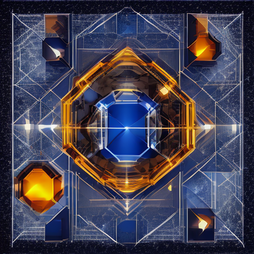

# Отчёт по лабораторной работе №4

## 1. Цель и вариант

**Дисциплина:** «Искусственный интеллект в креативных технологиях»  
**Вариант:** 6 — постер для медиалаборатории  
**Студент:** _Провков Иван Александрович_  
**Группа:** _МИК11_  
**Дата выполнения:** 17.09.2026

Цель работы — локально запустить открытую text-to-image модель, получить изображение и проверить воспроизводимость результата.

Для варианта 6 изменяемый фактор — **иерархия объектов в prompt**.  
Критерий результата — главный объект должен визуально доминировать.

## 2. Модель и параметры

- Модель: `stabilityai/sd-turbo`
- Ревизия: `b261bac6fd2cf515557d5d0707481eafa0485ec2`
- Prompt: `poster concept for a media laboratory, one large luminous geometric media core as the dominant central object, two or three smaller translucent modular forms as secondary elements around it, dark navy background, cobalt blue and warm amber lighting, clean symmetrical composition, strong visual hierarchy, spacious negative space, no text, no logo, no people, no client materials`
- Seed: `20260917`
- Число шагов: `1`
- Guidance scale: `0.0`
- Размер: `512 × 512`
- Тип данных: `torch.float32`
- Детерминированные алгоритмы PyTorch: `True`
- Число потоков PyTorch: `1`

## 3. Среда

- ОС: Windows 11
- Процессор: AMD Ryzen 5 5500U with Radeon Graphics
- Python: `3.12.0`
- PyTorch: `2.7.1+cpu`
- Torchvision: `0.22.1+cpu`
- Diffusers: `0.40.0`
- Transformers: `5.17.0`
- Accelerate: `1.15.0`
- Safetensors: `0.8.0`

Полный список пакетов сохранён в `reports/environment.txt`.

## 4. Результаты двух запусков

| Проверка | Запуск 1 | Запуск 2 |
| --- | ---: | ---: |
| Время генерации, с | 73.359 | 41.858 |
| Размер файла, байт | 557023 | 557023 |
| Размер изображения | 512 × 512 | 512 × 512 |
| Цветовой режим | RGB | RGB |
| SHA-256 | `670eaba0e8962cd7924d4265ab22430c276e6c69d9a8d6923b574c26c823637d` | `670eaba0e8962cd7924d4265ab22430c276e6c69d9a8d6923b574c26c823637d` |

Побитовое сравнение: **PASS**.

Два PNG полностью совпадают; одинаковый SHA-256 подтверждает повторяемость результата в пределах данной зафиксированной CPU-среды.



Главный синий геометрический объект расположен в центре и визуально доминирует над более мелкими периферийными элементами. Критерий варианта 6 выполнен.

## Угрозы валидности и альтернативные объяснения

Эксперимент выполнен только для одного prompt и одного seed. Поэтому подтверждена воспроизводимость конкретного запуска, но не доказано сохранение той же визуальной иерархии при других seed.

Визуальное доминирование центрального объекта оценивалось человеком и частично субъективно. Его можно объяснить не только формулировкой иерархии в prompt, но также размером объекта, центральным расположением, цветовым и световым контрастом.

Совпадение SHA-256 получено в одной зафиксированной CPU-среде. Оно не доказывает побитовую воспроизводимость на GPU, другой ОС, при другом dtype или других версиях библиотек.

Время генерации различалось: `run_001` — 73.359 с, `run_002` — 41.858 с. Это не доказывает ускорение алгоритма: различие могли вызвать прогретый кэш, уже загруженные компоненты модели, состояние ОС и текущая нагрузка компьютера.

## 5. Типовая ошибка

Для безопасного воспроизведения ошибки создана копия `src/run_cuda_error.py`.

В ней использован:

```python
torch.Generator(device="cuda")
```

При CPU-сборке PyTorch получена ошибка:

```text
RuntimeError: Cannot get CUDA generator without ATen_cuda library.
```

Причина — попытка использовать CUDA в среде без CUDA backend.  
Исправление — использовать `torch.Generator(device="cpu")` либо предварительно проверять доступность CUDA.

Полный вывод сохранён в `reports/cuda_error.log`.

## 6. Безопасность и ограничения

Prompt не содержит персональных данных, реальных лиц, логотипов и клиентских материалов.

Совпадение SHA-256 подтверждает точное совпадение двух запусков только в данной зафиксированной CPU-среде. Оно не гарантирует побитовую воспроизводимость между разными устройствами, ОС или версиями библиотек.

Pipeline не содержит safety checker, поэтому такой запуск допустим только для контролируемого учебного эксперимента с безопасным prompt.

## Лицензия и Acceptable Use Policy

Использована модель `stabilityai/sd-turbo`, ревизия `b261bac6fd2cf515557d5d0707481eafa0485ec2`, распространяемая по [Stability AI Community License Agreement](https://huggingface.co/stabilityai/sd-turbo/blob/b261bac6fd2cf515557d5d0707481eafa0485ec2/LICENSE.md). Использование в этой работе учебное и некоммерческое и должно соответствовать [Stability AI Acceptable Use Policy](https://stability.ai/use-policy).

Prompt является авторским. Персональные данные, реальные лица, логотипы, товарные знаки и закрытые клиентские материалы не использовались. Полученное изображение является учебным концептом.

## 7. Артефакты

- `configs/run_config.json` — параметры запуска;
- `src/run_reproducibility.py` — основной скрипт;
- `src/run_cuda_error.py` — воспроизведение типовой ошибки;
- `artifacts/run_001/` и `artifacts/run_002/` — PNG и JSON-манифесты;
- `reports/environment.txt` — окружение;
- `reports/sha256_comparison.json` — сравнение результатов;
- `reports/cuda_error.log` — журнал типовой ошибки.

Репозиторий: **https://github.com/oneway192/ai-in-ci/tree/main**

## 8. Итог

Статус проверки: **PASS**.

Получен постер для медиалаборатории, соответствующий критерию варианта 6. Два запуска с одинаковыми параметрами дали полностью совпадающие PNG-файлы, что подтверждает воспроизводимость результата в пределах использованной среды.

## Приложение A. Manifest первого запуска

Манифест приведён без изменения фактических значений, зафиксированных во время выполнения эксперимента.

```json
{
  "created_utc": "2026-09-23T11:51:14.367584+00:00",
  "model_id": "stabilityai/sd-turbo",
  "revision_requested": "b261bac6fd2cf515557d5d0707481eafa0485ec2",
  "prompt": "poster concept for a media laboratory, one large luminous geometric media core as the dominant central object, two or three smaller translucent modular forms as secondary elements around it, dark navy background, cobalt blue and warm amber lighting, clean symmetrical composition, strong visual hierarchy, spacious negative space, no text, no logo, no people, no client materials",
  "seed": 20260917,
  "num_inference_steps": 1,
  "guidance_scale": 0.0,
  "height": 512,
  "width": 512,
  "device": "cpu",
  "dtype": "torch.float32",
  "platform": "Windows-11-10.0.26200-SP0",
  "python": "3.12.0",
  "processor": "AMD64 Family 23 Model 104 Stepping 1, AuthenticAMD",
  "packages": {
    "torch": "2.7.1+cpu",
    "torchvision": "0.22.1+cpu",
    "diffusers": "0.40.0",
    "transformers": "5.17.0",
    "accelerate": "1.15.0",
    "safetensors": "0.8.0",
    "huggingface-hub": "1.32.0",
    "Pillow": "12.3.0"
  },
  "deterministic_algorithms": true,
  "torch_num_threads": 1,
  "model_load_seconds_measured": 397.74109480017796,
  "hf_home": "D:\\dev\\ai-in-cr\\LR01\\cache\\huggingface",
  "run": 1,
  "run_name": "run_001",
  "generation_seconds_measured": 73.35870139999315,
  "artifact": "artifacts\\run_001\\result.png",
  "artifact_size_bytes": 557023,
  "image_size_observed": [
    512,
    512
  ],
  "image_mode_observed": "RGB",
  "sha256": "670eaba0e8962cd7924d4265ab22430c276e6c69d9a8d6923b574c26c823637d"
}
```

Поле `hf_home` отражает фактический путь к кэшу на момент выполнения эксперимента до последующего переименования каталога работы.
